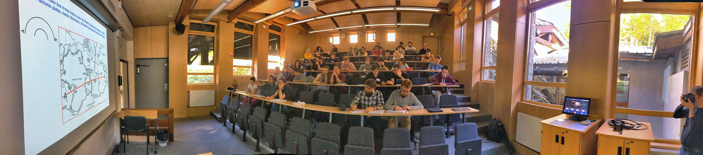

# The school

This summer school follows the
[CIDER](https://seismo.berkeley.edu/wiki_cider/Main_Page) program with
two weeks of formal lectures and tutorials and two weeks of working on interdisciplinary
research projects in small groups. The topics are chosen by
brainstorming during the first two weeks. It is open to advanced PhD
students and postdocs. 

# Program

Core-mantle interactions from the formation of the Earth to the
present time.

Lectures on seismology, geodynamics, geomagnetism, geochemistry,
mineral physics. 

Reseach projects in small inter-disciplinary groups, with one or two
senior researchers. 

# Scientific committee

* Stéphane Labrosse, ENS de Lyon, France.
* Barbara Romanowicz, UC Berkeley, US and Collège de France.
* Tine Thomas, Univ. Münster, Germany.
* Paul J. Tackley, ETH Zürich, Switzerland.
* Véronique Dehant, Observatoire Royal de Belgique.
* John Brodholt, University College London.
* Philippe Cardin, ISTerre, Grenoble, France.

# Application and registration fee

The number of participants is limited to 50, the scientific committe will select
the participants to ensure a diversity of fields. Applicants must send
a CV with a few words on the topics of interest.

Applications will open soon (November). 

The registration fee is 1920€ (tax included) and covers the costs for
lodging and meals for the four weeks. Depending on grants we may
obtain in the next few months, we may be able to offer fellowships to
selected participants.

Participants and lecturers may bring family to the school at their own
expanse, at a rate of 64.80€/day for age above 12 and 32.40€/day
for kids between 4 and 12 years old. Baby sitters may be arranged and
full day care could be accomdated in the village
[(https://www.leshouches.fr/education-enfance/centre-de-loisirs/)](https://www.leshouches.fr/education-enfance/centre-de-loisirs/).

# Location

[Les Houches school of Physics](https://www.houches-school-physics.com/)
is located in Les Houches, at the entrance of the Chamonix valley, at
the foot of the Mont-Blanc, in the French Alps. It offers all
necessary facilities, with a lecture room (70 seats, see image by Ed Garnero), several rooms
for group working, internet access, a restaurant and chalets for
housing. The price of school includes food, lodging and access to all
facilities for the four weeks. 

